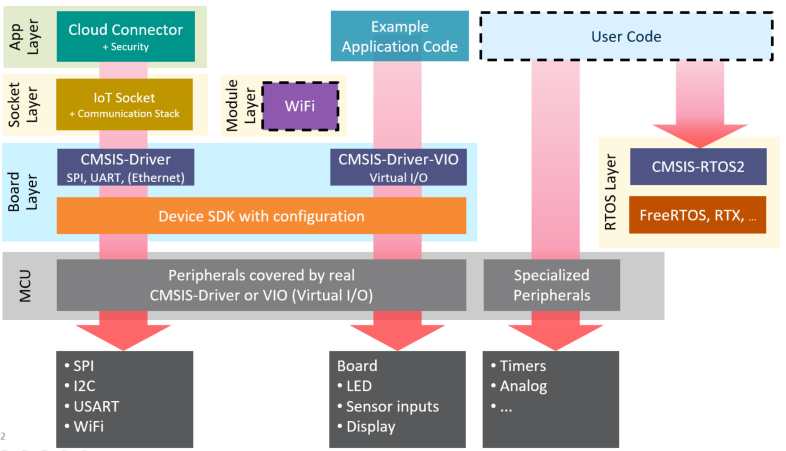

# CB_Lab4Layer

This is the experimental [__CMSIS-Build__](https://arm-software.github.io/CMSIS_5/Build/html/index.html) Laboratory that uses project layers to compose multiple project examples 
from a set of different software packs.  

CMSIS-Build can generate multiple reference examples for many different evaluation kits that demonstrate the 
functionality of complex software stacks.  The range of examples is not limited, it can start from a simple 
RTOS based Blinky to more complex examples such as Cloud IoT connectors, or Machine Learning examples.

## Directory Structure

Directory    | Content Description
:------------|:----------------
`./build`    | Input: Scripts that generate reference examples from layers
`./layer`    | Output/Input: Layers extracted from master projects that are used to generate reference examples
`./project`  | Input: Master projects that are used to extract the layers
`./docs`     | Documentation that explains how to create the demo examples from scratch
`./demo`     | Demo examples (published on http://www2.keil.com/iot)

__Note:__ this is work in progress and there are several gaps that we will close in the near future:

Output projects are currently manually configured for MDK (uVision).  In future, the Board pack should define the debug configuration of example projects.
Board may have on-board debug adapters and therefore the debug settings depends on the target board that is used.

The various projects are based on [__software packs that public available__](./Pack.md).

## Layers for IoT Cloud Examples

The following diagram shows the various layers that are used to compose the IoT Cloud examples.



Layer        | Implements 
:------------|:----------------
Board        | Base setup of a evaluation board; it includes CMSIS-Drivers and typically uses the device SDK
RTOS         | RTOS kernel used in the example application
Socket       | IP (internet) communication; frequently a TCP/IP stack
Module       | WiFi Shield used in the example; a separate layer to make it easy to change Arduino shields
App          | Application example; for IoT Cloud examples it contains typically a Cloud SDK

The examples are composed in a way that the device configuration is preserved and can be adopted to the
requirements of a complex user application. It allows move this examples to bespoke hardware and extended
it further with user code.

## Working with the Examples

The following steps describe how to generate working examples from the content of the `.\layer` directory.

1. __Start bash shell__: and set  the  `.\build` directory as base directory (start bash there or use the `cd` command).
```
      /c/Work/CB_Lab4Layer/build (master)
      $
```

2. __Setup CMSIS-Build__: execute the CMSIS-Build setup script.
```
      $ source /c/CMSIS-Build/cbuild/etc/setup
      Set CMSIS_PACK_ROOT=/C/ARM/PACK
      Set CMSIS_BUILD_ROOT=/c/CMSIS-Build/cbuild/bin
      Set CMSIS_COMPILER_ROOT=/c/CMSIS-Build/cbuild/etc
      Added /c/CMSIS-Build/cbuild/bin into the PATH
```

3. __Compose a single project from layers__: For this step it is necessary to understand which layers can be combined. Valid combinations are in the `ProjectList.txt` (# is a comment line that lists future combinations). 
   The example below composes the project AWS_MQTT_Demo for 32F746GDISCOVERY board using ESP8266 module and WiFi socket with RTX as RTOS
```
      $ ./gen_proj.sh App=AWS_MQTT_Demo Board=32F746GDISCOVERY Module=ESP8266 Socket=WiFi RTOS=RTX --layer=../Layer
      Generate project from layers
      Output:  AWS_MQTT_Demo/32F746GDISCOVERY_ESP8266_WiFi_RTX
      Project: AWS_MQTT_Demo.cprj
      (cbuildgen): Build Process Manager 0.9.0 (C) 2020 ARM
      M650: Command completed successfully.
```

4. __Compose multiple projects out of layers__: The file `ProjectList.txt` provides the verified combinations. To compose all project combinations execute the following script:
```
      $ ./gen_proj_list.sh ProjectList.txt --layer=../Layer
```

5. __Build a composed project__:
Invoke CMSIS-Build using the .cprj file directly from the build directory (or from the target sub-directory)
```
      $ cbuild.sh AWS_MQTT_Demo/32F746GDISCOVERY_ESP8266_WiFi_RTX/AWS_MQTT_Demo.cprj
      (cbuild.sh): Build Invocation 0.9.0 (C) 2019-2020 ARM
      ... 
      cbuild.sh finished successfully!
```
