# NUCLEO-STM32L552ZE-Q AWS MQTT Workbook

This workbook explains the necessary steps to create an IoT application that connects to the AWS cloud. Pre-built application examples can be obtained from the [IoT](http://www2.keil.com/iot) page on keil.com.

The following material is using the [STMicroelectronics NUCLEO-STM32L552ZE-Q](https://www.st.com/en/evaluation-tools/nucleo-l552ze-q.html) development board. It explains how to set up a project in Arm Keil MDK (using STM32CubeMX for setting up the device) and the necessary configuration steps. It shows how to add an application that sends MQTT messages to the AWS cloud.

This is the list of steps:

- [Setting up the Hardware](#setting-up-the-hardware)
- [Setting up the Project](#setting-up-the-project)
- [Configuring the Device](#configuring-the-device)
- [Adding Software Components](#adding-software-components)
- [Configuring Software Components](#configuring-software-components)
- [Running the Application](#running-the-application)

*Prerequisites:*

- It is assumed that you have basic knowledge of the C programming language.
- The following software needs to be installed on your computer:
  - [Arm Keil MDK](https://www2.keil.com/mdk5/install/) (with a valid license for MDK-Essential/Plus/Professional; you can enable a [30-day trial license](https://www.keil.com/support/man/docs/license/license_eval.htm) from within Keil MDK)
  - [STMicroelectronics STM32CubeMX](https://www.st.com/en/development-tools/stm32cubemx.html)
  - [STMicroelectronics STM32CubeProgrammer](https://www.st.com/content/st_com/en/products/development-tools/software-development-tools/stm32-software-development-tools/stm32-programmers/stm32cubeprog.html)
- If you want to use this example project with Trusted Firmware for Cortex-M (TF-M), make sure that you finish the workbooks "NUCLEO-STM32L552ZE-Q AWS Secure Firmware" and "NUCLEO-STM32L552ZE-Q AWS Key Provisioning" first.

# Setting up the Hardware

The following describes the necessary steps to set up the development board hardware, as well as the WiFi shield that is used to connect to the Internet via an access point (AP).

## Setting up the NUCLEO-STM32L552ZE-Q

There are no specific settings required for the example project to work on the development board. All jumpers should be set to the default locations. But the chip itself may require some configuration with STM32CubeProgrammer, depending on the previous usage and the application that will be built using this workbook.

### Setting up the STM32L552ZET6Q

1. If your device is fresh out of the box, there is no further setup required, if you are not using TrustZone with this example.
2. When using TrustZone, make sure that the following **Option bytes (OB)** are set using STM32CubeProgrammer:
   - Read Out Protection - RDP: AA (Level 0, no protection)
   - User Configuration - DBANK: Checked (Dual bank mode with 64 bits data)
   - User Configuration - TZEN: Checked (Global TrustZone security enabled)
   - Secure Area 1 - SECWM1_PSTRT - Value: 0x0, SECWM1_PEND - Value: 0x7f (Flash bank 1 secure: will be used for the TF-M project)
   - Secure Area 2 - SECWM2_PSTRT - Value: 0x60, SECWM2_PEND - Value: 0x7f (Flash bank 2 non-secure: will be used for the AWS MQTT project; the last 64 kB secure: will be used for the client private key)
3. If your device has already the TZEN set, make sure that you change the Flash bank settings as shown above. This is required for correct operation of the example project.

## Setting up the WiFi Shield

Currently, three different WiFi shields (connecting to the Arduino expansion header on the development board) are supported. The hardware setup is explained here:

- [Inventek ISM43362](https://www2.keil.com/iot/shields/ismart43362/)
- [SparkFun ESP8266](https://www2.keil.com/iot/shields/wrl13287)
- [WizNet WizFi360](https://www2.keil.com/iot/shields/wizfi360/)

*Note:* Make sure that your WiFi shield is attached correctly on the Arduino header extension.

# Setting up the Project

> Before the actual project is created, make sure that all required software packs are downloaded and installed on you computer.

## Install CMSIS-Packs

Open  Pack Installer. Download and install the latest versions of the following software packs:

- **ARM.CMSIS-Driver** (2.6.1 or above) to add the WiFi driver for the shield.
- **ARM.mbedTLS** (1.6.1 or above) to add cryptographic extensions.
- **MDK-Packs.IoT_Socket** (2.0.0-beta or above) to add the IoT socket API.
- **MDK-Packs.AWS_IoT_Device** (2.0.0-beta or above) to add the MQTT client component.
- **Keil.STM32L5xx_DFP** (1.2.0 or above) to add device support. 

## Creating the Project

- Start µVision and go to **Project - New µVision Project...**
- Select your project directory and enter a meaningful project name, for example *MQTT_Demo*:
  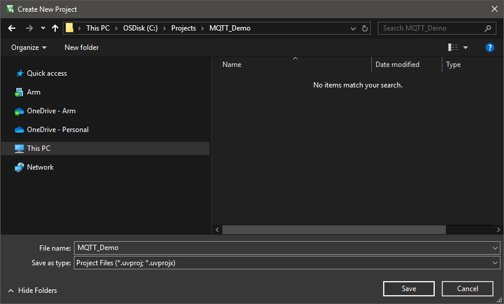
- Click *Save*.
- The device selection window opens. Enter *STM32L552ZE* in the **Search:** box and select the device *STM32L552ZETxQ*.
    
- Click *OK*.
- The Manage Run-Time Environment window opens.
- Go to *Device - STM32CUbe Framework (API) - STM32CubeMX* and enable it.
  
- Click *OK*.
- In the next window, click *Start STM32CubeMX* to run the application.

# Configuring the Device

STM32CubeMX opens with the device preconfigured and loaded:


## Configuring Pins

> For the correct operation of the serial interfaces with the Arduino connector, you need to set the following.

On the **Pinout & Configuration** tab, go to **System Core - GPIO** and change the following GPIO pins:

|Name|Mode       |Label           |Output Level|Maximum Output Speed|
|----|-----------|----------------|------------|--------------------|
|PD14|GPIO_Output|ISM43362_SPI_NSS|High        |Very High           |
|PD15|GPIO_Input |ISM43362_DATARDY|N/A         |N/A                 |
|PD8 |USART3_TX  |N/A             |N/A         |N/A                 |
|PD9 |USART3_RX  |N/A             |N/A         |N/A                 |

*Note:* The USART pins will be configured later (refer to [USART3](#usart3))

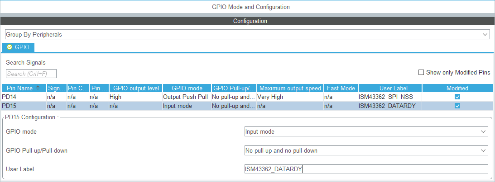

## Configuring NVIC

> For the correct operation of Keil RTX5 RTOS, preemption priorities have to be set right.

On the **Pinout & Configuration** tab, go to **System Core - NVIC**. On the **NVIC** tab,  set the following preemption priorities:

|NVIC Interrupt                         |Preemption Priority|
|---------------------------------------|-------------------|
|System service call via SWI instruction|6                  |
|Pendable request for system service    |7                  |
|Time base: System tick timer           |7                  |


On the **Code generation** tab, disable the following handlers:

|Interrupt                              |Handler             |
|---------------------------------------|--------------------|
|System service call via SWI instruction|Generate IRQ handler|
|Pendable request for system service    |Generate IRQ handler|
|Time base: System tick timer           |Generate IRQ handler|
|Time base: System tick timer           |Call HAL handler    |


## Configuring the Instruction Cache

> To speed up the overall processing time, we enable the instruction cache of the STM32L5.

On the **Pinout & Configuration** tab, go to **System Core - ICACHE** and set it to *2-ways set associative cache*:


## Configuring the Connectivity

> For connecting the Arduino shield to the development board, the serial interfaces have to be set up correctly. In the following, the set up for both, USART and SPI, are described. You can skip an interface that you do not use in your application.

### USART3 

> The currently supported WiFi shields using UART communication, connect to the pins D0 and D1 on the [Arduino Uno V3 header](https://content.arduino.cc/assets/Pinout-UNOrev3_latest.pdf). According to the [NUCLEO-STM32L552ZE-Q User Manual](https://www.st.com/resource/en/user_manual/dm00615305-stm32l5-nucleo144-board-mb1361-stmicroelectronics.pdf), these pins are connected to USART3 on the STM32L5.

On the **Pinout & Configuration** tab, go to **System Core - Connectivity - USART3** and set the **Mode** to *Asynchronous*. Under **Configuration - NVIC Settings**, enable the **USART3 global interrupt**:

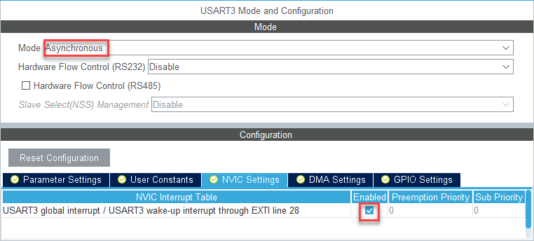

Under **Configuration - GPIO Settings**, change the **Maximum output speed** of the GPIO pins PD8 and PD9 to *Very High*:

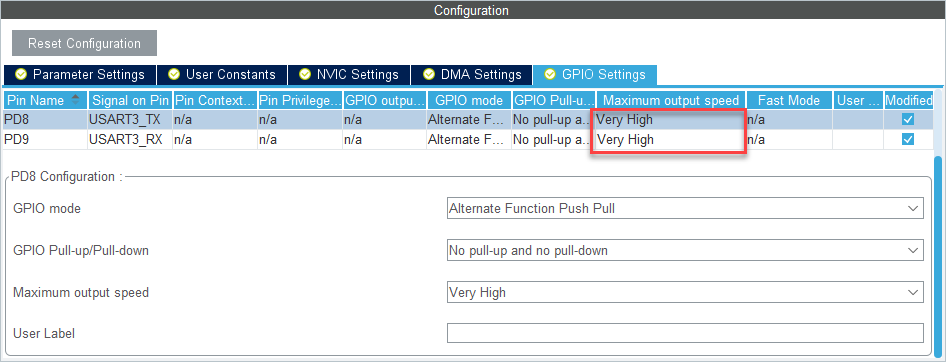

### SPI1

> The currently supported WiFi shields using SPI communication, connect to the pins D11 - D13 on the [Arduino Uno V3 header](https://content.arduino.cc/assets/Pinout-UNOrev3_latest.pdf). According to the [NUCLEO-STM32L552ZE-Q User Manual](https://www.st.com/resource/en/user_manual/dm00615305-stm32l5-nucleo144-board-mb1361-stmicroelectronics.pdf), these pins are connected to SPI1 on the STM32L5.

On the **Pinout & Configuration** tab, go to **System Core - Connectivity - SPI1** and set the **Mode** to *Full-Duplex Master*. Under **Configuration - Parameter Settings**, set the **Prescaler (for Baud Rate)** to *4*:

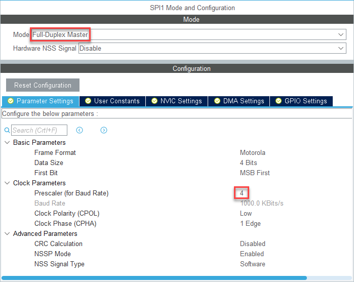

Under **Configuration - NVIC Settings**, enable the **SPI1 global interrupt**:

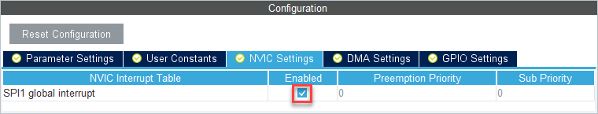

Under **Configuration - GPIO Settings**, change the **Maximum output speed** of all GPIO pins to *Very High*:

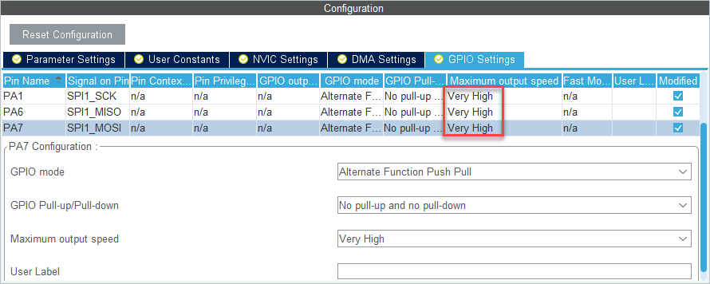

## Clock Configuration

> To achieve the right baud rates for the serial interfaces, the clock setup needs to be changed.

On the **Clock Configuration** tab, change the **System Clock Mux** to use the *PLLCLK* and set the **N** multiplier to *55*:


## Managing the Code Generation and Output

On the **Project Manager** tab, in the **Code Generator** section, enable *Add necessary library files as reference in the toolchain project configuration file*:


On the **Project Manager** tab, in the **Advanced Settings** section, enable *Note Generate Function Call* for **SPI1** and **USART3**:

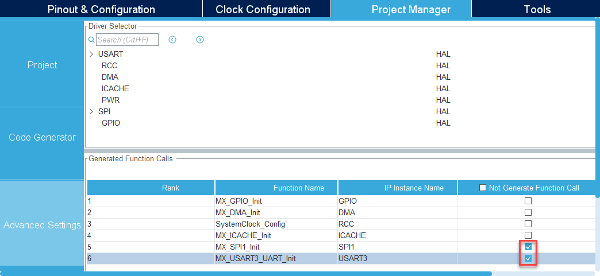

## Generate Code

Finally, press the **Generate Code** button and return to µVision:


Do not open the generated project, but just close STM32CubeMX now. Returning to the project is always possible using the  Play button in the **Manage Run-Time Environment** window of µVision.

µVision detects that the STM32CUbeMX configuration is done and asks to import the changes:


Click *Yes* to import the changes.

# Adding Software Components

## Setting up the Project

> Before adding the software components, there are some project setting that need to be done. As this is a Armv8-M based microcontroller, the correct [Software Model](https://www.keil.com/pack/doc/CMSIS/Core/html/using_TrustZone_pg.html) needs to be selected. As Arm Compiler 6 is quite verbose in the generation of warnings, we can set the verbosity to match the previous Arm Compiler 5.

Go to **Project - Options for Target (Alt+F7)** or use the target options button  and switch to the **Target** tab. In the **Code Generation** box, set the **Software Model** as follows:
- *Non-Secure Mode* if you are using the MQTT example project together with a TF-M project *or*
- *TrustZone disabled* if you are running the project without a secure foundation.
  
  

Go to the **C/C++ (AC6)** tab and select the following:
- **Warnings:** *AC5-like Warnings*
- Add these **Preprocessor Symbols**: `RunDemo=RunMqttDemo` and `SECURE_PRIVATE_KEY` (if you are using TF-M):

  

## Managing the Software Components

> In the following step, the required software components will be added.

Go to **Project - Manage - Run-Time Environment...** or press  to open the **Manage Run-Time Environment** window:


Select the following software components:

- ::CMSIS:RTOS2 (API):Keil RTX5, Variant: Source_NS (if you are using the project with TF-M) *or*
- ::CMSIS:RTOS2 (API):Keil RTX5, Variant: Source (if you are using the project without TF-M)
- ::CMSIS:CORE
- ::Compiler:I/O:STDOUT, Variant: ITM
- ::IoT Utility:Socket:WiFi
- ::Security:mbed TLS
- ::TFM:API, Variant: SFN (if you are using the project with TF-M)
- ::IoT Client:AWS
- ::IoT Utility:AWS:MQTT
- ::IoT Utility:AWS:Common
- ::IoT Utility:AWS:Platform

Depending on the the WiFI module you are using, select one of the following CMSIS-Drivers:

- [ESP8266](#esp8266-components)
- [WizFi360](#wizfi360-components)
- [ISM43362](#ism43362-components)

### ESP8266 Components

- ::CMSIS Driver:WiFi (API):ESP8266, Variant: UART
- ::CMSIS Driver:USART (API): USART

### WizFi360 Components

- ::CMSIS Driver:WiFi (API):WizFi360, Variant: UART
- ::CMSIS Driver:USART (API): USART

### ISM43362 Components

- ::CMSIS Driver:WiFi (API):ISM43362, Variant: SPI
- ::CMSIS Driver:SPI (API): SPI

Use the **Resolve** button to add other required components automatically. The **Validation Output** should not show any messages anymore.

# Configuring Software Components

> In this section, the software components that have been added to the project are configured to match the underlying hardware and software.

## Configuring the Heap Size

> The default heap size is not big enough to run the project successfully, so it is required to increase it.

In the µVision **Project** window, under **Device**, double-click the **startup_stm32l552xx.s** file and change the **Heap_Size** to *0x00010000*:


## Configuring the WiFi Module

Depending on the the WiFI module you are using, configure one of the following:

- [ESP8266](#esp8266-configuration)
- [WizFi360](#wizfi360-configuration)
- [ISM43362](#ism43362-configuration)

### ESP8266 Configuration

> You need to add the UART interface number that is used to connect to the WiFI modules. As we have seen in the STM32CubeMX configuration section, this is UART #3:

In the µVision **Project** window, under **CMSIS Driver**, double-click the **WiFi_ESP8266_Config.h** file and change the **WIFI_ESP8266_SERIAL_DRIVER** to *3*:

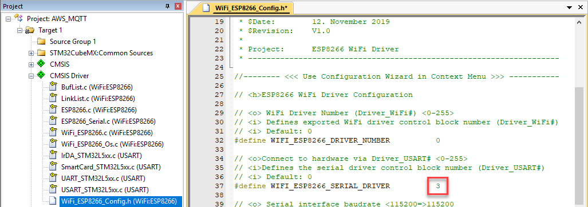

### WizFi360 Configuration

> You need to add the UART interface number that is used to connect to the WiFI modules. As we have seen in the STM32CubeMX configuration section, this is UART #3:

In the µVision **Project** window, under **CMSIS Driver**, double-click the **WiFi_WizFi360_Config.h** file and change the **SWIFI_WIZ360_SERIAL_DRIVER** to *3*:

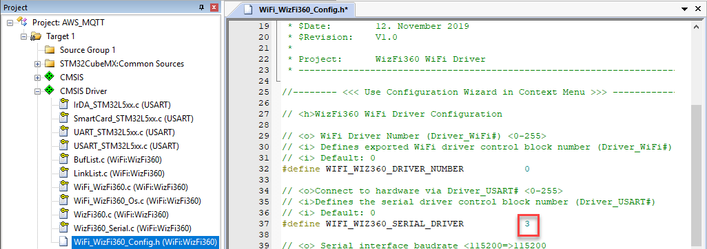

### ISM43362 Configuration

> You need to add the SPI interface number that is used to connect to the WiFI modules. As we have seen in the STM32CubeMX configuration section, this is SPI #1:

In the µVision **Project** window, under **CMSIS Driver**, double-click the **WiFi_ISM43362_Config.h** file and change the **WIFI_ISM43362_SPI_DRV_NUM** to *1*:

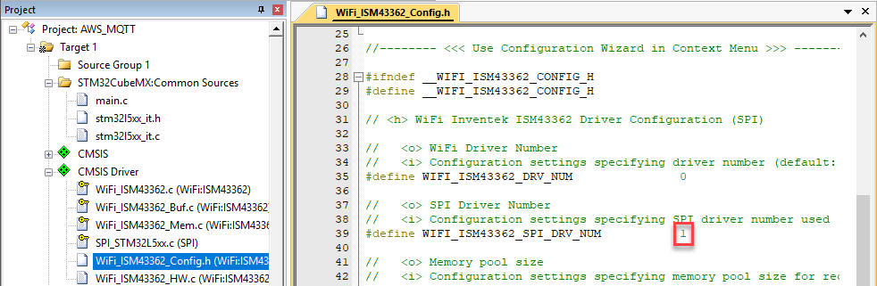

> You need to add some code to actually use the SPI driver:

In the µVision **Project** window, under **CMSIS Driver**, double-click the **WiFi_ISM43362_HW.c** file and add the following:

- Around line 30, add:
  ```C
  #include "main.h"
  ```
- In the function **WiFi_ISM43362_Pin_SSN()**, around line 85, add:
  ```C
    HAL_GPIO_WritePin(ISM43362_SPI_NSS_GPIO_Port, ISM43362_SPI_NSS_Pin, ssn ? GPIO_PIN_RESET : GPIO_PIN_SET);
  ```
- In the function **WiFi_ISM43362_Pin_DATARDY()**, around line 100, add:
  ```C
    return (HAL_GPIO_ReadPin(ISM43362_DATARDY_GPIO_Port, ISM43362_DATARDY_Pin) == GPIO_PIN_SET);
  ```

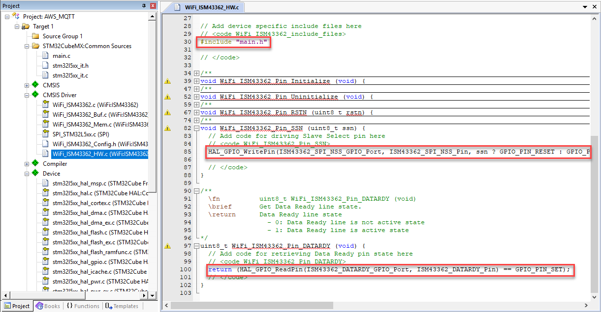

## [Optional/TF-M] Configuring Trusted Firmware for Cortex-M (TF-M)

*Note:* The following is not required for projects that do not make use of TF-M

> This example uses two services from TF-M that need to be enabled in the corresponding configuration file.

In the µVision **Project** window, under **TFM**, double-click the **tfm_config.h** file, go to the **Configuration Wizard** view, and enable only:

- *Internal Trusted Storage*
- *Crypto*


### [Optional/TF-M] Adding the CMSE Library

> A non-secure project needs to use a CMSE library from a secure project to be able to have calls between secure and non-secure partitions. This library needs to be added manually so that the project compiles successfully.

In the µVision **Project** window, right-click **Target 1** and select **Add Group...**:

- Slowly double-click the added item **New Group** until you are able to change its name. Rename the group to *CMSE_Lib*.
- Right-click **CMSE_Lib** and select **Add New Item to Group 'CMSE_Lib'...**.
- A new dialog opens that allows you to browse to the location of the CMSE library that will be created from your TF-M project. Select **Image File (.*)** on the left and specify the file name and path (this depends on where your secure FW will be built):
  

## Working on the Source Code

> Before you can build and run the application, some final changes in the source code need to be made.

### Changing main.h

Go to **File - Open (Ctrl+O)** and browse to .\RTE\Device\STM32L552ZETxQ\STCubeGenerated\Inc and open **main.h**. Add the following includes in the section `USER CODE BEGIN Includes` (around line 35):

```C
#include "cmsis_os2.h"
#include "tfm_ns_interface.h" // add this only if you are using TF-M
```

Add the following prototype in the section `USER CODE BEGIN EFP` (around line 57):

```C
extern void app_initialize (void);
```


### Adding app_main.c

In the µVision **Project** window, right-click on **Source Group 1**, and select **Add New Item to Group 'Source Group 1'...**. Add a new C file called *app_main.c*:

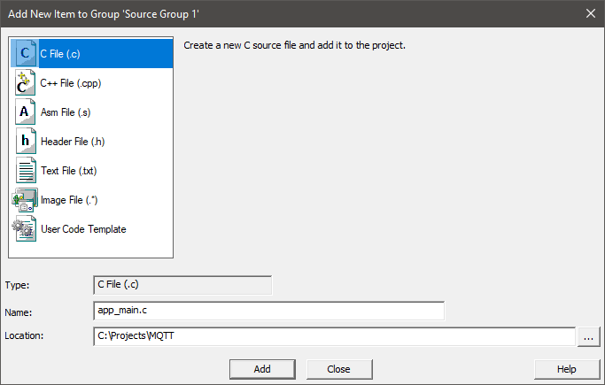

Add the following code to the newly created C file:

```C
#include <stdint.h>
#include <stdio.h>
#include "cmsis_os2.h"
#include "main.h"

extern int32_t socket_startup (void);   // external function that initializes the WiFi and connects to an AP
extern int32_t demo (void);             // The actual demo application

// Create an application specific stack size:
static const osThreadAttr_t app_main_attr = {
  .stack_size = 4096U
};

/*-----------------------------------------------------------------------------
 * Application main thread
 *----------------------------------------------------------------------------*/
static void app_main (void *argument) {
  int32_t status;

  printf("MQTT Demo\r\n");

  status = socket_startup();  // start the WiFi connection
  if (status == 0) {
    demo();                   // run the demo
  }
}

/*-----------------------------------------------------------------------------
 * Application initialization
 *----------------------------------------------------------------------------*/
void app_initialize (void) {
  osThreadNew(app_main, NULL, &app_main_attr);  // create a new thread with the custom stack size as defined above
}
```

### Adding socket_startup.c

In the µVision **Project** window, right-click on **Source Group 1**, and select **Add New Item to Group 'Source Group 1'...**. Add a new C file called *socket_startup.c*. Add the following code to the newly created C file:
```C
#include <stdint.h>
#include <string.h>
#include <stdio.h>

#include "Driver_WiFi.h"

#define SSID            ""
#define PASSWORD        ""
#define SECURITY_TYPE   ARM_WIFI_SECURITY_WPA2

extern ARM_DRIVER_WIFI Driver_WiFi0;

int32_t socket_startup (void) {
  ARM_WIFI_CONFIG_t config;

  printf("Connecting to WiFi ...\r\n");

  Driver_WiFi0.Initialize  (NULL);
  Driver_WiFi0.PowerControl(ARM_POWER_FULL);
  
  memset((void *)&config, 0, sizeof(config));

  config.ssid     = SSID;
  config.pass     = PASSWORD;
  config.security = SECURITY_TYPE;
  config.ch       = 0U;

  Driver_WiFi0.Activate(0U, &config);

  if (Driver_WiFi0.IsConnected() == 0U) {
    printf("WiFi network connection failed!\r\n");
    return (-1);
  } else {
    printf("WiFi network connection succeeded!\r\n");
  }
  return 0;
}
```

*Note:* Make sure to enter **SSID** (line 7) and **PASSWORD** (line 8) to match the requirements of your WiFi network.

### Changing main.c

In the µVision **Project** window, under **STM32CubeMX: Common Sources**, double-click the **main.c** file and change the following:

- In the section `USER CODE BEGIN PD` (around line 35), add this:
  ```C
  #define DELAY_SLOW_CYCLES       2U
  ```

- In the section `USER CODE BEGIN 0` (around line 70), override the default `HAL_GetTick` function with this code:
  ```C
  volatile uint32_t DEBUG_Tick = 0;
  uint32_t HAL_GetTick (void) {
    static uint32_t ticks = 0U;
           uint32_t i;
  
    if (osKernelGetState () == osKernelRunning) {
      DEBUG_Tick = osKernelGetTickCount ();
      return ((uint32_t)osKernelGetTickCount ());
    }
  
    /* If Kernel is not running wait approximately 1 ms then increment 
       and return auxiliary tick counter value */
    for (i =((SystemCoreClock >> 14U)*DELAY_SLOW_CYCLES); i > 0U; i--) {
      __NOP(); __NOP(); __NOP(); __NOP(); __NOP(); __NOP();
      __NOP(); __NOP(); __NOP(); __NOP(); __NOP(); __NOP();
    }
    return ++ticks;
  }
  ```

- In the section `USER CODE BEGIN 2` (around line 120), add the following initialization functions that are required to start the RTOS Kernel, the trusted firmware, and the application:
  ```C
    /* Initialize CMSIS-RTOS2 */
    osKernelInitialize ();
  
    /* Initialize the TFM NS interface */
    tfm_ns_interface_init();
  
    /* Initialize application */
    app_initialize();
  
    /* Start thread execution */
    osKernelStart();
  ```

### Adding the Demo Modules

> The AWS_IoT_Device Pack provides the modules for the demo application sending MQTT messages (a simple Hello World) to the AWS cloud.

Open **Windows Explorer (Win+E)** and browse to your pack installation folder (usually either **C:\Keil_v5\ARM\Packs** or %localappdata%\Arm\Packs) and find the folder **MDK-Packs\AWS_IoT_Device\version\demos**. Copy the following files to your project directory:

- From the sub-folder **app** copy the file *iot_demo.c*
- From the sub-folder **include** copy the file *iot_demo_logging.h*
- From the sub-folder **src** copy the file *iot_demo_mqtt.c*

In the µVision **Project** window, right-click on **Source Group 1**, and select **Add Existing Files to Group 'Source Group 1'...**. Add the three files to your project:

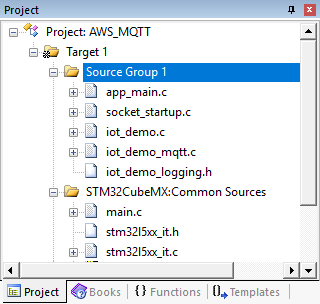

### Providing your Thing Credentials

> The following requires an active and properly configured [thing](https://www2.keil.com/iot/aws) in your AWS account. 

In the µVision **Project** window, under **IoT Client**, double-click the **iot_config.h** file and change the following:

 - `IOT_DEMO_SERVER`: Remote Host
 - `IOT_DEMO_ROOT_CA`: Trusted Server Root Certificate
 - `IOT_DEMO_CLIENT_CERT`: Client Certificate
 - `IOT_DEMO_PRIVATE_KEY`: Client Private Key (leave this empty when you are using a TF-M project as the private key is stored separately in the key provisioning project)
 - `IOT_DEMO_IDENTIFIER`: Thing Identifier

# Building the application

Go to **Project - Build Target (F7)** or use the build button  to start the compilation of the project. A successful build will show no errors or warnings (be sure to check your warning level as explained in (Setting up the Project)[#setting-up-the-project].

*Note:* If you are using this demo application together with the TF-M project, make sure that project is built first, as this example requires the CMSE library that is created during the build of the trusted firmware.

# Running the application

> Before running the application, you need to set the debug adapter and the correct trace frequency to see the `printf()` output in the **Debug (printf) Viewer** window of the µVision debugger.

## Target Driver Setup

Go to **Project - Options for Target (Alt+F7)** or use the target options button  and switch to the **Debug** tab:

1. Select to **Use:** the *ST-Link Debugger*
2. Press **Settings**:

   

The **Cortex-M Target Driver Setup** window opens. Make sure that in the **SW Device** box, an **IDCODE** is shown. Then, go to the **Trace** tab. Enter the following settings:

- Core Clock: *110 MHz* (as this is the correct core clock frequency; this setting is required to be able ot synchronize the **Debug (printf) Viewer** window output)
- Select **Trace Enable** (required for ITM trace which shows the `printf()` output)
- Make sure that **Use Core Clock** is selected (the device uses the same clock for trace)
- Disable **Timestamps** and **EXCTRC: Exception Tracing** (to reduce the load on the serial wire trace)
- Click *OK* twice.


## Flash Download

Go to **Flash - Download (F8)** or use the Flash download button  to transfer the application into the target's Flash memory.

*Notes:*

- If you are using this demo application together with the TF-M project, make sure that project is flashed first. Then, flash the key provisioning project and run it once. This is required to store the client private key in the internal secure storage (IST).
- If you encounter problems ("Error: Flash Download failed"), try to erase the Flash first, using **Flash - Erase**.

## Start Debugging

Go to **Debug - Start/Stop Debug Session (Ctrl+F5)** or use the debug button  to enter a debug session.

- To view the `printf()` messages, go to **View - Serial Windows - Debug (printf) Viewer** or use the debug viewer button .
- Go to **Debug - Run (F5)** or use the run button  to start the program execution.
- Observe the messages in the **Debug (printf) Viewer** window:
  ```
  MQTT Demo
  Connecting to WiFi ...
  WiFi network connection succeeded!
  [INFO ][INIT] SDK successfully initialized.
  [INFO ][NET] Network library initialized.
  [INFO ][MQTT] MQTT library successfully initialized.
  [INFO ][DEMO] MQTT demo client identifier is XXXXXXXXX (length 9).
  [INFO ][NET] (Network connection 2000d2a0) TLS handshake successful.
  [INFO ][NET] (Network connection 2000d2a0) New network connection established.
  [INFO ][MQTT] Establishing new MQTT connection.
  [INFO ][MQTT] Anonymous metrics (SDK language, SDK version) will be provided to AWS IoT. Recompile with AWS_IOT_MQTT_ENABLE_METRICS   set to 0 to disable.
  [INFO ][MQTT] (MQTT connection 2000e738, CONNECT operation 2000e7e0) Waiting for operation completion.
  [INFO ][MQTT] (MQTT connection 2000e738, CONNECT operation 2000e7e0) Wait complete with result SUCCESS.
  [INFO ][MQTT] New MQTT connection 20005af0 established.
  [INFO ][MQTT] (MQTT connection 2000e738) SUBSCRIBE operation scheduled.
  [INFO ][MQTT] (MQTT connection 2000e738, SUBSCRIBE operation 2000e7e0) Waiting for operation completion.
  [INFO ][MQTT] (MQTT connection 2000e738, SUBSCRIBE operation 2000e7e0) Wait complete with result SUCCESS.
  [INFO ][DEMO] All demo topic filter subscriptions accepted.
  [INFO ][DEMO] Publishing messages 0 to 9.
  [INFO ][MQTT] (MQTT connection 2000e738) MQTT PUBLISH operation queued.
  [INFO ][DEMO] Waiting for 10 publishes to be received.
  [INFO ][DEMO] MQTT PUBLISH 0 successfully sent.
  [INFO ][DEMO] Incoming PUBLISH received:
  Subscription topic filter: iotdemo/topic/1
  Publish topic name: iotdemo/topic/1
  Publish retain flag: 0
  Publish QoS: 1
  Publish payload: Hello world 0!
  [INFO ][MQTT] (MQTT connection 2000e738) MQTT PUBLISH operation queued.
  [INFO ][DEMO] Acknowledgement message for PUBLISH 0 will be sent.
  [INFO ][DEMO] MQTT PUBLISH 1 successfully sent.
  [INFO ][DEMO] Incoming PUBLISH received:
  Subscription topic filter: iotdemo/topic/2
  Publish topic name: iotdemo/topic/2
  Publish retain flag: 0
  Publish QoS: 1
  ...
  [INFO ][NET] (Network connection 2000d2a0) Connection closed.
  [INFO ][MQTT] (MQTT connection 2000e738) Network connection closed.
  [ERROR][NET] (Network connection 2000d2a0) Error polling network connection. error: NET - Polling the net context failed. 
  [INFO ][MQTT] (MQTT connection 2000e738) Network connection destroyed.
  [INFO ][MQTT] MQTT library cleanup done.
  [INFO ][NET] Network library cleanup done.
  [INFO ][INIT] SDK cleanup done.
  [INFO ][DEMO] Demo completed successfully.
  ```

Log into your AWS account to the the published payload showing up in your console.
