# NUCLEO-STM32L552ZE-Q AWS Key Provisioning

This workbook explains the necessary steps to create an application that stores the AWS keys securely on your device. Pre-built application examples can be obtained from the [IoT](http://www2.keil.com/iot) page on keil.com.

The following material is using the [STMicroelectronics NUCLEO-STM32L552ZE-Q](https://www.st.com/en/evaluation-tools/nucleo-l552ze-q.html) development board. It explains how to set up a project in Arm Keil MDK (using STM32CubeMX for setting up the device) and the necessary configuration steps. It shows how to add an application that sends MQTT messages to the AWS cloud.

This is the list of steps:

- [Setting up the Hardware](#setting-up-the-hardware)
- [Setting up the Project](#setting-up-the-project)
- [Configuring the Device](#configuring-the-device)
- [Adding Software Components](#adding-software-components)
- [Configuring Software Components](#configuring-software-components)
- [Running the Application](#running-the-application)

*Prerequisites:*

- It is assumed that you have basic knowledge of the C programming language.
- The following software needs to be installed on your computer:
  - [Arm Keil MDK](https://www2.keil.com/mdk5/install/) (with a valid license for MDK-Essential/Plus/Professional; you can enable a [30-day trial license](https://www.keil.com/support/man/docs/license/license_eval.htm) from within Keil MDK)
  - [STMicroelectronics STM32CubeMX](https://www.st.com/en/development-tools/stm32cubemx.html)
  - [STMicroelectronics STM32CubeProgrammer](https://www.st.com/content/st_com/en/products/development-tools/software-development-tools/stm32-software-development-tools/stm32-programmers/stm32cubeprog.html)
- You need to use this example project with Trusted Firmware for Cortex-M (TF-M), so make sure that you finish the workbooks "NUCLEO-STM32L552ZE-Q Trusted Firmware for Cortex-M (TF-M)" first.

# Setting up the Hardware

The following describes the necessary steps to set up the development board hardware, as well as the WiFi shield that is used to connect to the Internet via an access point (AP).

## Setting up the NUCLEO-STM32L552ZE-Q

There are no specific settings required for the example project to work on the development board. All jumpers should be set to the default locations. But the chip itself may require some configuration with STM32CubeProgrammer, depending on the previous usage and the application that will be built using this workbook.

### Setting up the STM32L552ZET6Q

1. If your device is fresh out of the box, there is no further setup required, if you are not using TrustZone with this example.
2. When using TrustZone, make sure that the following **Option bytes (OB)** are set using STM32CubeProgrammer:
   - Read Out Protection - RDP: AA (Level 0, no protection)
   - User Configuration - DBANK: Checked (Dual bank mode with 64 bits data)
   - User Configuration - TZEN: Checked (Global TrustZone security enabled)
   - Secure Area 1 - SECWM1_PSTRT - Value: 0x0, SECWM1_PEND - Value: 0x7f (Flash bank 1 secure: will be used for the TF-M project)
   - Secure Area 2 - SECWM2_PSTRT - Value: 0x60, SECWM2_PEND - Value: 0x7f (Flash bank 2 non-secure: will be used for the AWS MQTT project; the last 64 kB secure: will be used for the client private key)
3. If your device has already the TZEN set, make sure that you change the Flash bank settings as shown above. This is required for correct operation of the example project.

# Setting up the Project

> Before the actual project is created, make sure that all required software packs are downloaded and installed on you computer.

## Install CMSIS-Packs

Open  Pack Installer. Download and install the latest versions of the following software packs:

- **ARM.CMSIS-Driver** (2.6.1 or above) to add the WiFi driver for the shield.
- **ARM.TFM** (2.0.0 or above) to add support for Arm's Platform Security Architecture (PSA).
- **ARM.mbedTLS** (1.6.1 or above) to add cryptographic extensions.
- **Keil.ARM_Compiler** (1.6.3 or above) to add support for printf redirect. 
- **Keil.STM32L5xx_DFP** (1.2.0 or above) to add device support. 

## Creating the Project

- Start µVision and go to **Project - New µVision Project...**
- Select your project directory and enter a meaningful project name, for example *AWS_Key_Provisioning*:
  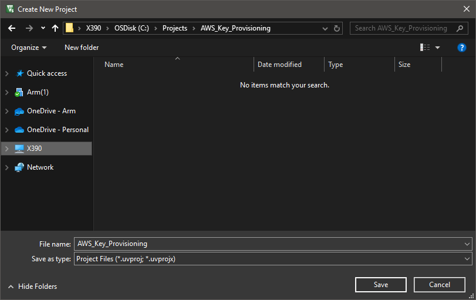
- Click *Save*.
- The device selection window opens. Enter *STM32L552ZE* in the **Search:** box and select the device *STM32L552ZETxQ*.
    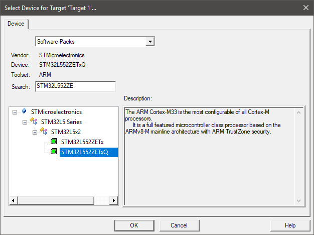
- Click *OK*.
- The Manage Run-Time Environment window opens.
- Go to *Device - STM32CUbe Framework (API) - STM32CubeMX* and enable it.
  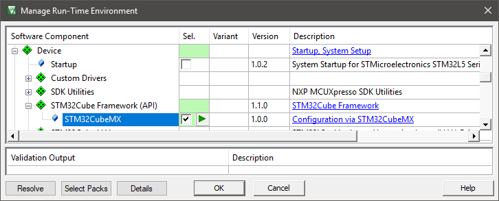
- Click *OK*.
- In the next window, click *Start STM32CubeMX* to run the application:

  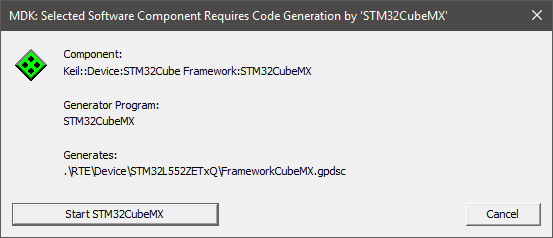

# Configuring the Device

STM32CubeMX opens with the device preconfigured and loaded:
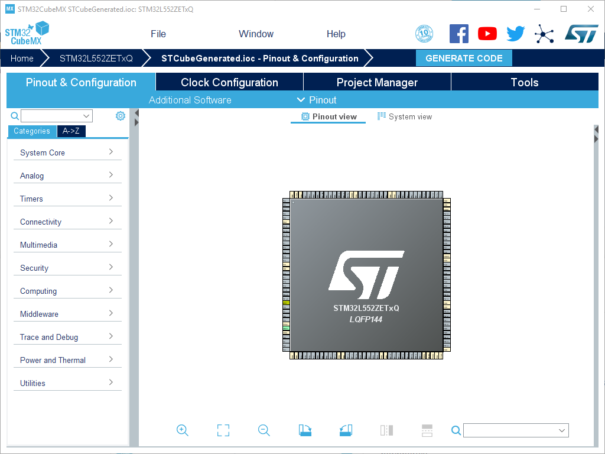

## Configuring NVIC

> For the correct operation of Keil RTX5 RTOS, preemption priorities have to be set right.

On the **Pinout & Configuration** tab, go to **System Core - NVIC**. On the **NVIC** tab,  set the following preemption priorities:

|NVIC Interrupt                         |Preemption Priority|
|---------------------------------------|-------------------|
|System service call via SWI instruction|6                  |
|Pendable request for system service    |7                  |
|Time base: System tick timer           |7                  |

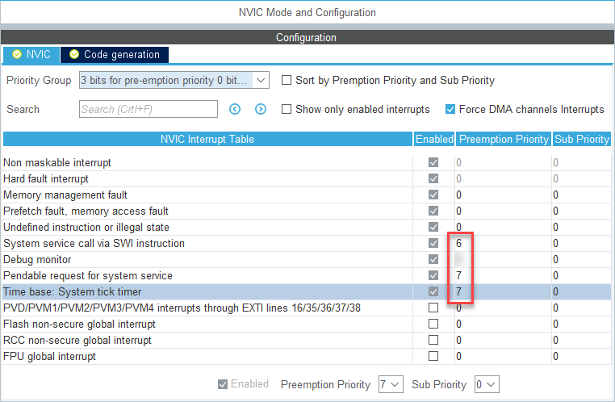

On the **Code generation** tab, disable the following handlers:

|Interrupt                              |Handler             |
|---------------------------------------|--------------------|
|System service call via SWI instruction|Generate IRQ handler|
|Pendable request for system service    |Generate IRQ handler|
|Time base: System tick timer           |Generate IRQ handler|
|Time base: System tick timer           |Call HAL handler    |

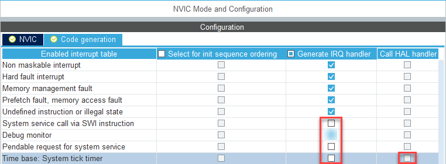

## Configuring the Instruction Cache

> To speed up the overall processing time, we enable the instruction cache of the STM32L5.

On the **Pinout & Configuration** tab, go to **System Core - ICACHE** and set it to *2-ways set associative cache*:


## Clock Configuration

> To achieve the right baud rates for the serial interfaces, the clock setup needs to be changed.

On the **Clock Configuration** tab, change the **System Clock Mux** to use the *PLLCLK* and set the **N** multiplier to *55*:

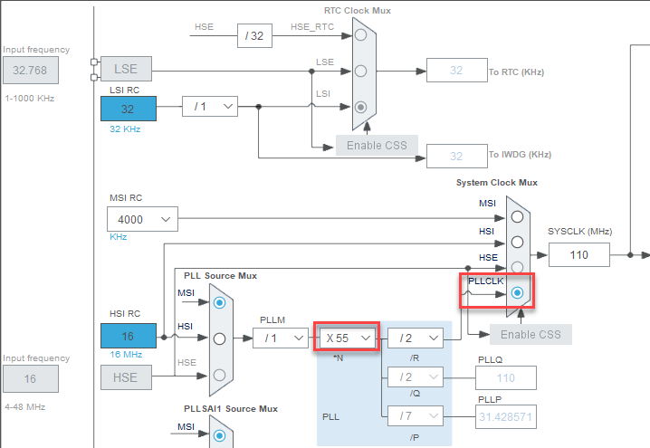

## Managing the Code Generation and Output

On the **Project Manager** tab, in the **Code Generator** section, enable *Add necessary library files as reference in the toolchain project configuration file*:

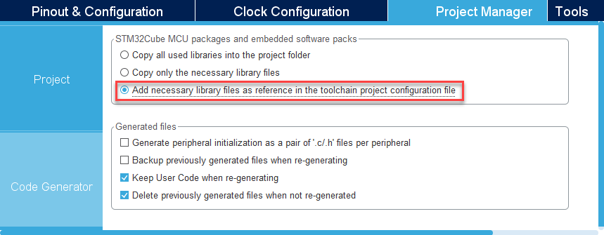

## Generate Code

Finally, press the **Generate Code** button and return to µVision:


Do not open the generated project, but just close STM32CubeMX now. Returning to the project is always possible using the  Play button in the **Manage Run-Time Environment** window of µVision.

µVision detects that the STM32CUbeMX configuration is done and asks to import the changes:


Click *Yes* to import the changes.

# Adding Software Components

## Setting up the Project

> Before adding the software components, there are some project setting that need to be done. As this is a Armv8-M based microcontroller, the correct [Software Model](https://www.keil.com/pack/doc/CMSIS/Core/html/using_TrustZone_pg.html) needs to be selected. As Arm Compiler 6 is quite verbose in the generation of warnings, we can set the verbosity to match the previous Arm Compiler 5.

Go to **Project - Options for Target (Alt+F7)** or use the target options button  and switch to the **Target** tab. In the **Code Generation** box, set the **Software Model** as follows:
- *Non-Secure Mode* if you are using the MQTT example project together with a TF-M project *or*
- *TrustZone disabled* if you are running the project without a secure foundation.
  
  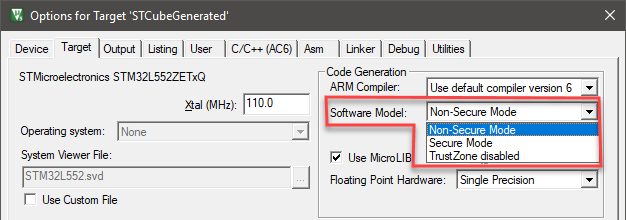

Go to the **C/C++ (AC6)** tab and select the following:
- **Warnings:** *AC5-like Warnings*
- Add these **Preprocessor Symbols**: `RunDemo=RunMqttDemo` and `SECURE_PRIVATE_KEY` (if you are using TF-M):

  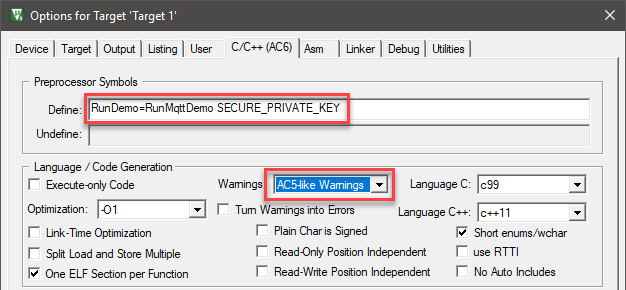

## Managing the Software Components

> In the following step, the required software components will be added.

Go to **Project - Manage - Run-Time Environment...** or press  to open the **Manage Run-Time Environment** window:

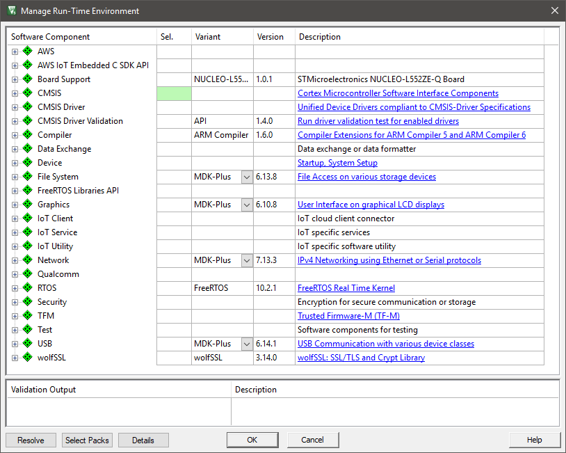

Select the following software components:

- ::CMSIS:RTOS2 (API):Keil RTX5, Variant: Source_NS
- ::CMSIS:CORE
- ::Security:mbed TLS
- ::Compiler:I/O:STDOUT, Variant: ITM
- ::TFM:API, Variant: SFN

Use the **Resolve** button to add other required components automatically. The **Validation Output** should not show any messages anymore.

# Configuring Software Components

> In this section, the software components that have been added to the project are configured to match the underlying hardware and software.

## Configuring the Heap Size

> The default heap size is not big enough to run the project successfully, so it is required to increase it.

In the µVision **Project** window, under **Device**, double-click the **startup_stm32l552xx.s** file and change the **Heap_Size** to *0x00010000*:

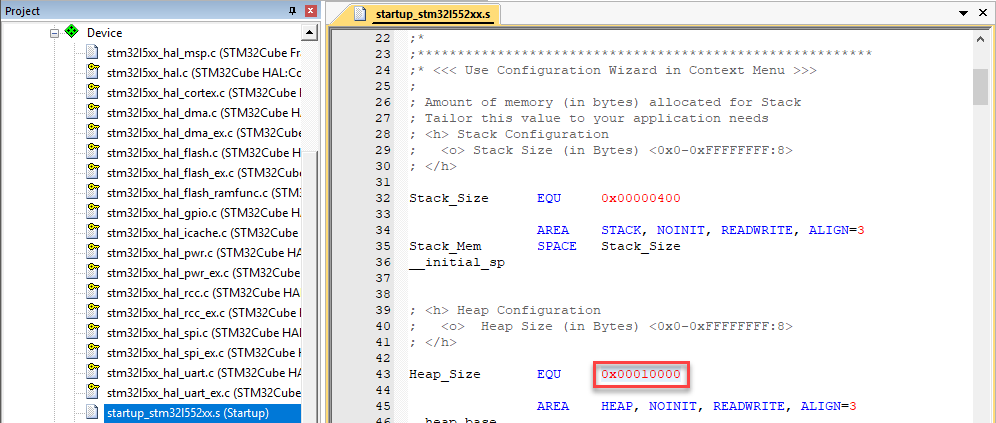

## Configuring Trusted Firmware for Cortex-M (TF-M)

> This example uses two services from TF-M that need to be enabled in the corresponding configuration file.

In the µVision **Project** window, under **TFM**, double-click the **tfm_config.h** file, go to the **Configuration Wizard** view, and enable only:

- *Internal Trusted Storage*
- *Crypto*

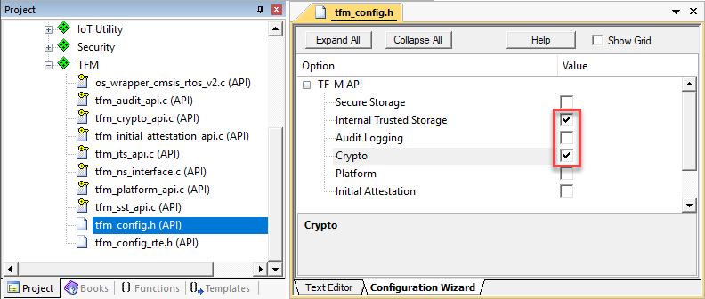

## Configuring mbedTLS

> For encryption purposes, mbedTLS is used which needs additional configuration.

In the µVision **Project** window, under **Security**, double-click the **mbedTLS_config.h** file, and uncomment the following settings:

```c
MBEDTLS_REMOVE_ARC4_CIPHERSUITES
MBEDTLS_ECP_DP_SECP256R1_ENABLED
MBEDTLS_ECP_NIST_OPTIM
MBEDTLS_ECDSA_DETERMINISTIC
MBEDTLS_PKCS1_V15
MBEDTLS_ASN1_PARSE_C
MBEDTLS_ASN1_WRITE_C
MBEDTLS_BASE64_C
MBEDTLS_BIGNUM_C
MBEDTLS_ECDH_C
MBEDTLS_ECDSA_C
MBEDTLS_ECP_C
MBEDTLS_HMAC_DRBG_C
MBEDTLS_MD_C
MBEDTLS_OID_C
MBEDTLS_PEM_PARSE_C
MBEDTLS_PK_C
MBEDTLS_PK_PARSE_C
MBEDTLS_RSA_C
```

### Adding the CMSE Library

> A non-secure project needs to use a CMSE library from a secure project to be able to have calls between secure and non-secure partitions. This library needs to be added manually so that the project compiles successfully.

In the µVision **Project** window, right-click **Target 1** and select **Add Group...**:

- Slowly double-click the added item **New Group** until you are able to change its name. Rename the group to *CMSE_Lib*.
- Right-click **CMSE_Lib** and select **Add New Item to Group 'CMSE_Lib'...**.
- A new dialog opens that allows you to browse to the location of the CMSE library that will be created from your TF-M project. Select **Image File (.*)** on the left and specify the file name and path (this depends on where your secure FW will be built):
  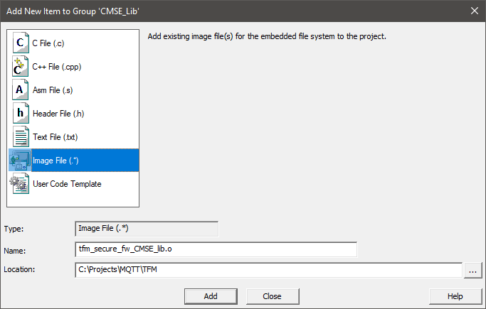

## Working on the Source Code

> Before you can build and run the application, some final changes in the source code need to be made.

### Changing main.h

Go to **File - Open (Ctrl+O)** and browse to .\RTE\Device\STM32L552ZETxQ\STCubeGenerated\Inc and open **main.h**. Add the following includes in the section `USER CODE BEGIN Includes` (around line 35):

```C
#include "cmsis_os2.h"
#include "tfm_ns_interface.h" // add this only if you are using TF-M
```

Add the following prototype in the section `USER CODE BEGIN EFP` (around line 59):

```C
extern void app_initialize (void);
```

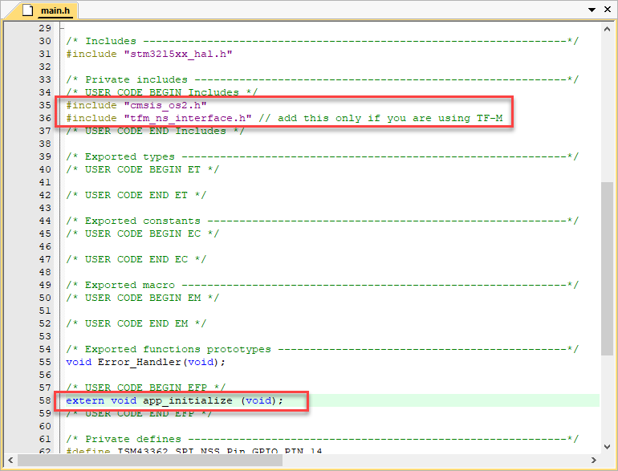

### Adding app_main.c

In the µVision **Project** window, right-click on **Source Group 1**, and select **Add New Item to Group 'Source Group 1'...**. Add a new C file called *app_main.c*:

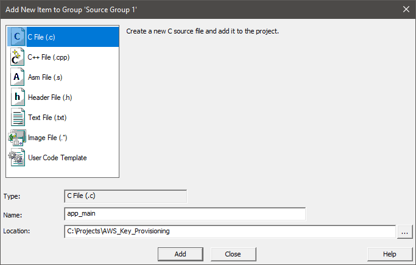

Add the following code to the newly created C file:

```C
#include <stdint.h>
#include <stdio.h>
#include <string.h>
#include "cmsis_os2.h"
#include "key_provisioning.h"
#include "iot_config.h"

static const osThreadAttr_t app_main_attr = {
  .stack_size = 4096U
};

/*-----------------------------------------------------------------------------
 * Application main thread
 *----------------------------------------------------------------------------*/
static void app_main (void *argument) {
  int32_t status;

  /* Startup delay */
  osDelay(1000U);

  printf("AWS IoT Key Provisioning \r\n");

  status = xProvisionPrivateKey((const uint8_t *)IOT_DEMO_PRIVATE_KEY,
                                 strlen(IOT_DEMO_PRIVATE_KEY) + 1U);
  if (status == 0) {
    printf("Done. \r\n");
  } else {
    printf("Failed!\r\n");
  }
}

/*-----------------------------------------------------------------------------
 * Application initialization
 *----------------------------------------------------------------------------*/
void app_initialize (void) {
  osThreadNew(app_main, NULL, &app_main_attr);
}
```

### Changing main.c

In the µVision **Project** window, under **STM32CubeMX: Common Sources**, double-click the **main.c** file and change the following:

- In the section `USER CODE BEGIN PD` (around line 35), add this:
  ```C
  #define DELAY_SLOW_CYCLES       2U
  ```

- In the section `USER CODE BEGIN 0` (around line 70), override the default `HAL_GetTick` function with this code:
  ```C
  volatile uint32_t DEBUG_Tick = 0;
  uint32_t HAL_GetTick (void) {
    static uint32_t ticks = 0U;
           uint32_t i;
  
    if (osKernelGetState () == osKernelRunning) {
      DEBUG_Tick = osKernelGetTickCount ();
      return ((uint32_t)osKernelGetTickCount ());
    }
  
    /* If Kernel is not running wait approximately 1 ms then increment 
       and return auxiliary tick counter value */
    for (i =((SystemCoreClock >> 14U)*DELAY_SLOW_CYCLES); i > 0U; i--) {
      __NOP(); __NOP(); __NOP(); __NOP(); __NOP(); __NOP();
      __NOP(); __NOP(); __NOP(); __NOP(); __NOP(); __NOP();
    }
    return ++ticks;
  }
  ```

- In the section `USER CODE BEGIN 2` (around line 120), add the following initialization functions that are required to start the RTOS Kernel, the trusted firmware, and the application:
  ```C
    /* Initialize CMSIS-RTOS2 */
    osKernelInitialize ();
  
    /* Initialize the TFM NS interface */
    tfm_ns_interface_init();
  
    /* Initialize application */
    app_initialize();
  
    /* Start thread execution */
    osKernelStart();
  ```

### Adding the Provisioning Modules

> A couple of modules are required that provide the secure key information and do the provisioning on the device. The following requires an active and properly configured [thing](https://www2.keil.com/iot/aws) in your AWS account. 

- In the µVision **Project** window, right-click on **Source Group 1**, and select **Add New Item to Group 'Source Group 1'...**. Add a new header file called *iot_config.h*:

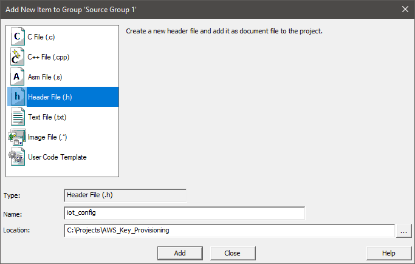

- Add the following code to the newly created C file:

```C
#ifndef IOT_CONFIG_H_
#define IOT_CONFIG_H_

/* Credentials. */
#define IOT_DEMO_PRIVATE_KEY           ""

#endif /* ifndef IOT_CONFIG_H_ */

```

- `IOT_DEMO_PRIVATE_KEY`: Provide your thing's client private key as available from your AWS account.

- In the µVision **Project** window, right-click on **Source Group 1**, and select **Add New Item to Group 'Source Group 1'...**. Add a new C file called *key_provisioning.c* and a new header file called *key_provisioning.h*:

**key_provisioning.c**

```c
#include <stdint.h>

/* PSA includes. */
#include "psa/crypto.h"

/* mbedTLS includes. */
#include "mbedtls/pk.h"
#include "mbedtls/asn1.h"

/* PSA Device Private Key ID. */
#ifndef PSA_DEVICE_PRIVATE_KEY_ID
#define PSA_DEVICE_PRIVATE_KEY_ID   1U
#endif

/*
 * Get the content of the privateKey field of the ECPrivateKey
 * format defined by RFC 5915.
 *
 * RFC 5915, or SEC1 Appendix C.4
 *
 * ECPrivateKey ::= SEQUENCE {
 *   version        INTEGER { ecPrivkeyVer1(1) } (ecPrivkeyVer1),
 *   privateKey     OCTET STRING,
 *   parameters [0] ECParameters {{ NamedCurve }} OPTIONAL,
 *   publicKey  [1] BIT STRING OPTIONAL
 * }
 */
static int get_ECPrivateKey_sequence_privatekey_sec1_der ( const uint8_t * key,
                                                           size_t keylen,
                                                           uint8_t **privatekeystart,
                                                           size_t * privatekeyderlength )
{
    int ret;
    int version;
    size_t len;
    uint8_t *p = (uint8_t *) key;
    uint8_t *end = p + keylen;

    if( ( ret = mbedtls_asn1_get_tag( &p, end, &len,
        MBEDTLS_ASN1_CONSTRUCTED | MBEDTLS_ASN1_SEQUENCE ) ) != 0 )
    {
        return( MBEDTLS_ERR_PK_KEY_INVALID_FORMAT + ret );
    }

    end = p + len;

    if( ( ret = mbedtls_asn1_get_int( &p, end, &version ) ) != 0 )
        return( MBEDTLS_ERR_PK_KEY_INVALID_FORMAT + ret );

    if( version != 1 )
        return( MBEDTLS_ERR_PK_KEY_INVALID_VERSION );

    if( ( ret = mbedtls_asn1_get_tag( &p, end, &len, MBEDTLS_ASN1_OCTET_STRING ) ) != 0 )
        return( MBEDTLS_ERR_PK_KEY_INVALID_FORMAT + ret );

    /* Finally get the start address of privatekey and its length. */
    *privatekeystart = p;
    *privatekeyderlength = len;

    return 0;
}

/**
 * @brief Provision Private Key.
 *
 * Uses mbed TLS to parse and PSA to store the private key in Internal Trusted Storage.
 * @param[in] pucPrivateKey Private Key (PEM).
 * @param[in] xPrivateKeyLength Private key length.
 *
 * @return `0` on success; negative value indicating error otherwise.
 */

int32_t xProvisionPrivateKey( const uint8_t * pucPrivateKey,
                              size_t xPrivateKeyLength )
{
    const uint8_t *pucKeyData;
    size_t xKeyDataSize;
    uint8_t *pucPrivateKeyDerStart;
    size_t xPrivateKeyDerSize;
    mbedtls_pk_context pk_ctx;
    mbedtls_pk_type_t pk_type;
    const mbedtls_ecp_keypair *ec;
    int ret;
    psa_key_handle_t key_handle;
    psa_key_attributes_t key_attributes;
    psa_key_type_t key_type;
    psa_algorithm_t algorithm;
    psa_ecc_curve_t curve_id;
    psa_status_t status;
    int32_t result = 0;

    mbedtls_pk_init( &pk_ctx );

    ret = mbedtls_pk_parse_key( &pk_ctx, pucPrivateKey, xPrivateKeyLength, NULL, 0U );
    if( ret != 0 )
    {
        result = -1;
    }

    if( result == 0 )
    {
        status = psa_crypto_init();
        if( status != PSA_SUCCESS )
        {
            result = -1;
        }
    }

    if( result == 0 )
    {
        status = psa_open_key( PSA_DEVICE_PRIVATE_KEY_ID, &key_handle );
        if( status == PSA_SUCCESS )
        {
            psa_destroy_key( key_handle );
        }
    }

    if( result == 0 )
    {

        pk_type = mbedtls_pk_get_type( &pk_ctx );
        switch ( pk_type )
        {
            case MBEDTLS_PK_RSA:
                key_type = PSA_KEY_TYPE_RSA_KEY_PAIR;
                switch( ( ( mbedtls_rsa_context * ) ( &pk_ctx ) )->padding )
                {
                    case MBEDTLS_RSA_PKCS_V15:
                        algorithm = PSA_ALG_RSA_PKCS1V15_SIGN( PSA_ALG_SHA_256 );
                        break;
                    case MBEDTLS_RSA_PKCS_V21:
                        algorithm = PSA_ALG_RSA_PSS( PSA_ALG_SHA_256 );
                        break;
                    default:
                        algorithm = 0U;
                        break;
                }
                pucKeyData = pucPrivateKey;
                xKeyDataSize = xPrivateKeyLength;
                break;
            case MBEDTLS_PK_ECKEY:
            case MBEDTLS_PK_ECDSA:
                ec = ( mbedtls_ecp_keypair * ) ( &pk_ctx );
                curve_id = mbedtls_ecp_curve_info_from_grp_id( ec->grp.id )->tls_id;
                key_type = PSA_KEY_TYPE_ECC_KEY_PAIR( curve_id );
                algorithm = PSA_ALG_ECDSA( PSA_ALG_SHA_256 );
                ret = get_ECPrivateKey_sequence_privatekey_sec1_der( pucPrivateKey,
                                                                     xPrivateKeyLength,
                                                                     &pucPrivateKeyDerStart,
                                                                     &xPrivateKeyDerSize );
                if( ret == 0 )
                {
                    pucKeyData = pucPrivateKeyDerStart;
                    xKeyDataSize = xPrivateKeyDerSize;
                }
                else
                {
                    key_type = PSA_KEY_TYPE_NONE;
                    algorithm = 0U;
                }
                break;
            default:
                key_type = PSA_KEY_TYPE_NONE;
                algorithm = 0U;
        }

        key_attributes = psa_key_attributes_init();
        psa_set_key_id( &key_attributes, PSA_DEVICE_PRIVATE_KEY_ID );
        psa_set_key_lifetime( &key_attributes, PSA_KEY_LIFETIME_PERSISTENT );
        psa_set_key_usage_flags( &key_attributes, PSA_KEY_USAGE_SIGN );
        psa_set_key_type( &key_attributes, key_type );
        psa_set_key_algorithm( &key_attributes, algorithm );

        status = psa_import_key( &key_attributes, pucKeyData, xKeyDataSize, &key_handle );
        if( status == PSA_SUCCESS )
        {
            psa_close_key( key_handle );
        }
        else
        {
            result = -1;
        }
    }

    return result;
}
```

**key_provisioning.h**

```c
#ifndef KEY_PROVISIONING_H_
#define KEY_PROVISIONING_H_

#include <stdint.h>

/**
 * @brief Provision Private Key.
 *
 * Uses mbed TLS to parse and PSA to store the private key in Internal Trusted Storage.
 * @param[in] pucPrivateKey Private Key (PEM).
 * @param[in] xPrivateKeyLength Private key length.
 *
 * @return `0` on success; negative value indicating error otherwise.
 */

int32_t xProvisionPrivateKey(const uint8_t *pucPrivateKey, size_t xPrivateKeyLength);

#endif /* KEY_PROVISIONING_H_ */
```

### Updating the Linker (Scatter) File

> STM32CubeMX provides a common scatter file that needs to be adapted for the project.

Go to **Project - Options for Target (Alt+F7)** or use the target options button  and switch to the **Linker** tab:

1. Unselect **Use Memory Layout from Target Dialog**
2. Click on ... next to the **Edit** button.
3. Browse to .\RTE\Device\STM32L552ZETxQ and select the file *stm32l552xe_flash_ns.sct* and click *Open*.
4. Click *Edit* to open the file in the µVision editor.

   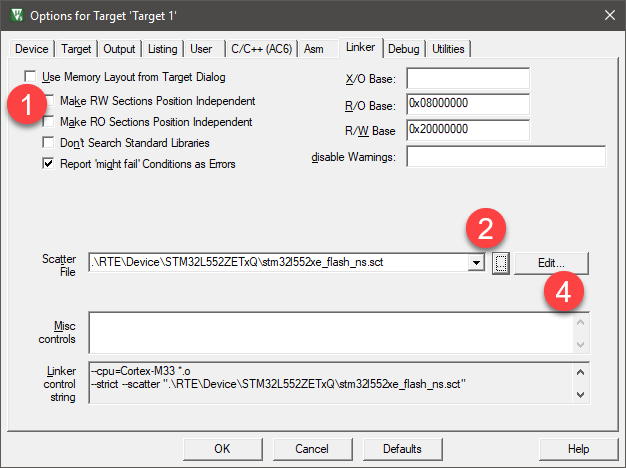

5. Configure the memory layout as done for the TF-M project (refer to the TF-M workbook for more information)

   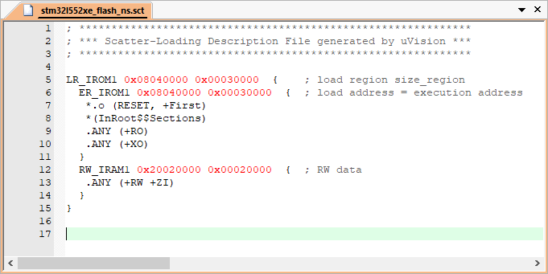

# Building the application

*Note:* As the key provisioning application is used together with the TF-M project, make sure that project is built first, as this example requires the CMSE library that is created during the build of the trusted firmware.

Go to **Project - Build Target (F7)** or use the build button  to start the compilation of the project. A successful build will show no errors or warnings (be sure to check your warning level as explained in (Setting up the Project)[#setting-up-the-project].

# Running the application

> Before running the application, you need to set the debug adapter and the correct trace frequency to see the `printf()` output in the **Debug (printf) Viewer** window of the µVision debugger.

## Target Driver Setup

Go to **Project - Options for Target (Alt+F7)** or use the target options button  and switch to the **Debug** tab:

1. Select to **Use:** the *ST-Link Debugger*
2. Press **Settings**:

   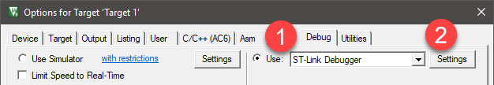

The **Cortex-M Target Driver Setup** window opens. Make sure that in the **SW Device** box, an **IDCODE** is shown. Then, go to the **Trace** tab. Enter the following settings:

- Core Clock: *110 MHz* (as this is the correct core clock frequency; this setting is required to be able ot synchronize the **Debug (printf) Viewer** window output)
- Select **Trace Enable** (required for ITM trace which shows the `printf()` output)
- Make sure that **Use Core Clock** is selected (the device uses the same clock for trace)
- Disable **Timestamps** and **EXCTRC: Exception Tracing** (to reduce the load on the serial wire trace)
- Click *OK* twice.

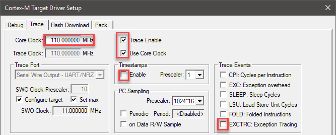

## Flash Download

Go to **Flash - Download (F8)** or use the Flash download button  to transfer the application into the target's Flash memory.

*Notes:*

- If you are using this demo application together with the TF-M project, make sure that project is flashed first. Then, flash the key provisioning project and run it once. This is required to store the client private key in the internal secure storage (IST).
- If you encounter problems ("Error: Flash Download failed"), try to erase the Flash first, using **Flash - Erase**.

## Start Debugging

Go to **Debug - Start/Stop Debug Session (Ctrl+F5)** or use the debug button  to enter a debug session.

- To view the `printf()` messages, go to **View - Serial Windows - Debug (printf) Viewer** or use the debug viewer button .
- Go to **Debug - Run (F5)** or use the run button  to start the program execution.
- Observe the messages in the **Debug (printf) Viewer** window:
  ```
  AWS IoT Key Provisioning 
  Done. 
  ```

You can now continue with setting up/flashing the AWS MQTT Demo project.
